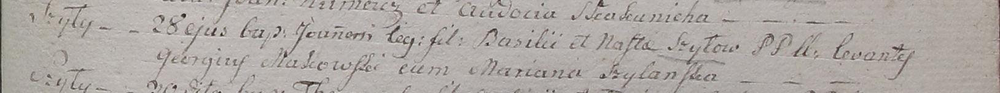

**Шило Ян Василев (Szyło Joann)**

28 июня 1799 г -- крещение (НИАБ 1781-27-199, лист 128, №32/1799-р).

**НИАБ 1781-27-199:** Лист 128. **Метрическая запись №32/1799-р.**

Дедиловичский костел Наисвятейшего Сердца Иисуса. 28 июля 1799 года.
Метрическая запись о крещении.

Szyło Joann -- сын крестьян с деревни Шилы.

Szyło Basili -- отец.

Szyłowa Nasta -- мать.

Makowski Georgiusz -- крестный отец.

Szyłanka Mariana -- крестная мать.

Linhart Hyacinthus -- ксёндз.
