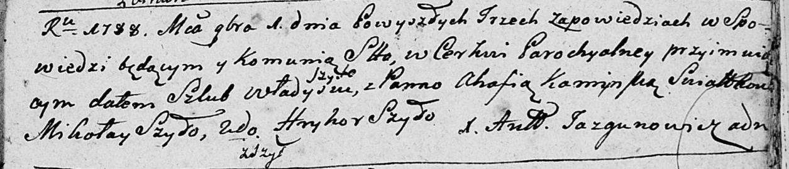
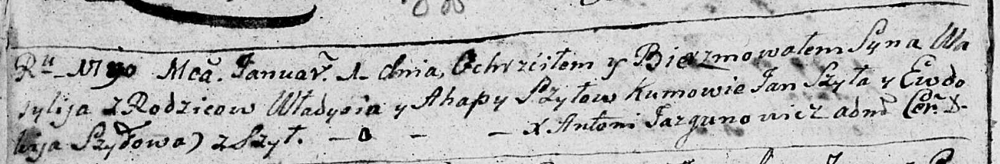
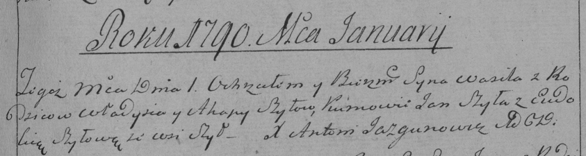
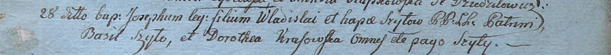
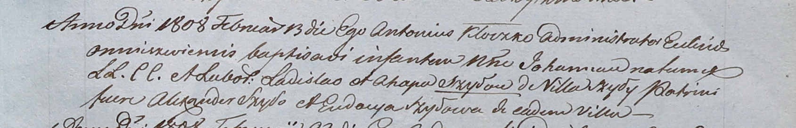
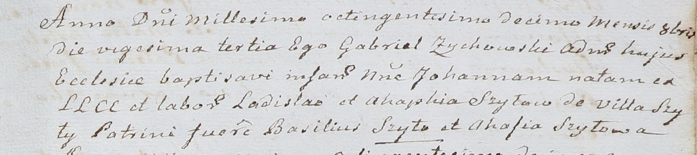

**Шило (Каминская) Агапа (Szyłowa Ahapa, Agatha z Kaminskich)**

1 ноября 1788 г -- венчание с Владысём Шылой (НИАБ 136-13-894, лист 67,
№10/1788-б (ориг)).

1 января 1790 г -- крещение сына Василия (НИАБ 136-13-894, лист 8об,
№1/1790-р (ориг)), (РГИА 823-2-18, лист 239, №1/1790-р (коп)).

28 апреля 1800 г -- крещение сына Иосифа (НИАБ 937-4-32, лист 1,
№12/1800-р).

22 июня 1802 г -- крещение дочери Магдалены (НИАБ 937-4-32, лист 6об,
№15/1803-р).

13 февраля 1808 г -- крещение дочери Иоганы (НИАБ 937-4-32, лист 18,
№8/1808-р).

23 октября 1810 г -- крещение дочери Иоганы младшей (НИАБ 937-4-32, лист
22, №15/1810-р).

**НИАБ 136-13-894:** Лист 67. **Метрическая запись №10/1788-б (ориг).**

Дедиловичская Покровская церковь. 1 ноября 1788 года. Метрическая запись
о венчании.

Szyło Władyś -- жених, с деревни Шилы.

Kaminska Ahafia -- невеста.

Szyło Mikołay -- свидетель.

Szyło Hryhor -- свидетель.

Jazgunowicz Antoni -- ксёндз.

**НИАБ 136-13-894:** Лист 8об. **Метрическая запись №1/1790-р (ориг).**

Дедиловичская Покровская церковь. 1 января 1790 года. Метрическая запись
о крещении.

Szyło Wasilij -- сын родителей с деревни Шилы.

Szyło Władyś -- отец.

Szyłowa Ahapa -- мать.

Szyło Jan - кум.

Szyłowa Ewdokija - кума.

Jazgunowicz Antoni -- ксёндз.

**РГИА 823-2-18:** Лист 239. **Метрическая запись №1/1790-р (коп).**

Дедиловичская Покровская церковь. 1 января 1790 года. Метрическая запись
о крещении.

Szyło Wasil -- сын родителей с деревни Шилы.

Szyło Władyś -- отец.

Szyłowa Ahapa -- мать.

Szyło Jan -- кум.

Szyłowa Eudokia - кума.

Jazgunowicz Antoni -- ксёндз.

**НИАБ 937-4-32:** Лист 1. **Метрическая запись №12/1800-р.**

Дедиловичский костел Наисвятейшего Сердца Иисуса. 28 апреля 1800 года.
Метрическая запись о крещении.

Szyło Joseph -- сын крестьян с деревни Шилы.

Szyło Władisław -- отец.

Szyłowa Hapa -- мать.

Szyło Basil -- крестный отец, с деревни Шилы.

Krasowska Dorothea -- крестная мать, с деревни Шилы.

Linhart Hyacinthus -- ксёндз.

**НИАБ 937-4-32:** Лист 6об. **Метрическая запись №15/1802-р.**

Дедиловичский костел Наисвятейшего Сердца Иисуса. 22 июня 1802 года.
Метрическая запись о крещении.

Szyłowna Magdalena -- дочь крестьян с деревни Шилы.

Szyło Władisław -- отец.

Szyłowa Agatha -- мать.

Szyło Basili -- крестный отец.

Rydzewska Francisca -- крестная мать, шляхтянка, с деревни Осово.

Linhart Hyacinthus -- ксёндз.

**НИАБ 937-4-32:** Лист 18. **Метрическая запись №8/1808-р.**

Дедиловичский костел Наисвятейшего Сердца Иисуса. 13 февраля 1808 года.
Метрическая запись о крещении.

Szyłowna Johanna -- дочь крестьян с деревни Шилы.

Szyło Ładisław -- отец.

Szyłowa Ahapa -- мать.

Szyło Alexander -- крестный отец.

Szyłowa Eudocia -- крестная мать, с деревни Шилы.

Kłoczko Antonius -- ксёндз, администратор Омнишевский.

**НИАБ 937-4-32:** Лист 22. **Метрическая запись №15/1810-р.**

Дедиловичский костел Наисвятейшего Сердца Иисуса. 23 октября 1810 года.
Метрическая запись о крещении.

Szyłowna Johanna -- дочь крестьян с деревни Шилы.

Szyło Ładisław -- отец.

Szyłowa Ahaphia -- мать.

Szyło Basili -- крестный отец.

Szyłowa Ahafia -- крестная мать.

Zychowski Gabriel -- ксёндз.
