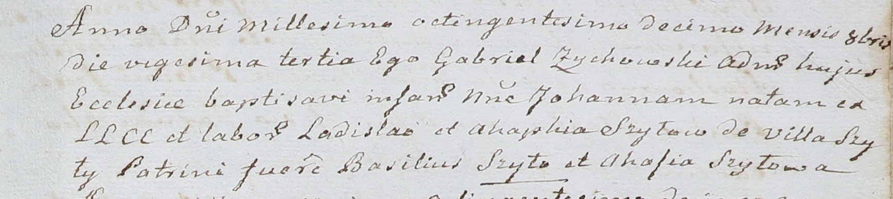

**Шило Иогана Владысева младшая (Szyłowna Johanna)**

23 октября 1810 г -- крещение (НИАБ 937-4-32, лист 22, №15/1810-р).

**НИАБ 937-4-32:** Лист 22. **Метрическая запись №15/1810-р.**

Дедиловичский костел Наисвятейшего Сердца Иисуса. 23 октября 1810 года.
Метрическая запись о крещении.

Szyłowna Johanna -- дочь крестьян с деревни Шилы.

Szyło Ładisław -- отец.

Szyłowa Ahaphia -- мать.

Szyło Basili -- крестный отец.

Szyłowa Ahafia -- крестная мать.

Zychowski Gabriel -- ксёндз.
