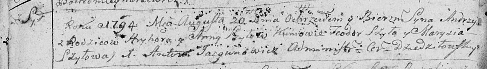

**Шило Андрей Грыгоров (Szyło Andrzey)**

20 августа 1794 г -- крещение сына Андрей (НИАБ 136-13-894, лист 22об,
№32/1794-р (ориг)), (РГИА 823-2-18, лист 250об, №23/1794-р (коп)).

**НИАБ 136-13-894:** Лист 22об. **Метрическая запись №32/1794-р
(ориг).**

Дедиловичская Покровская церковь. 20 августа 1794 года. Метрическая
запись о крещении.

Szyło Andrzey -- сын родителей с деревни Шилы.

Szyło Hryhory -- отец.

Szyłowa Anna -- мать.

Szyło Teodor - кум.

Szyłowa Marysia - кума.

Jazgunowicz Antoni -- ксёндз.

**РГИА 823-2-18:** Лист 250об. **Метрическая запись №23/1794-р (коп).**

Дедиловичская Покровская церковь. 20 августа 1794 года. Метрическая
запись о крещении.

Szyło Andrzey -- сын родителей с деревни Шилы.

Szyło Hryhor -- отец.

Szyłowa Anna -- мать.

Szyło Teodor -- кум.

Szyłowa Marysia -- кума.

Jazgunowicz Antoni -- ксёндз.
