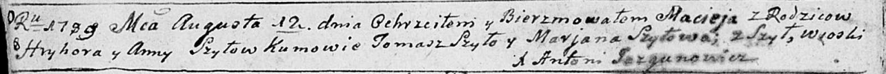
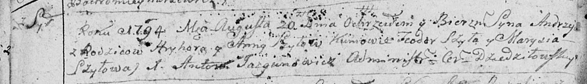
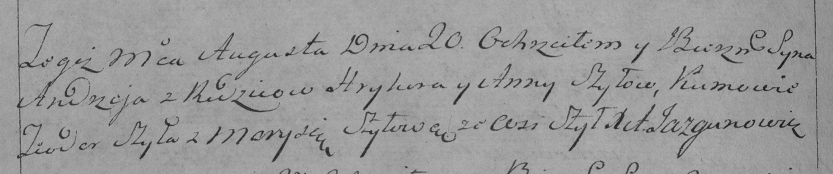
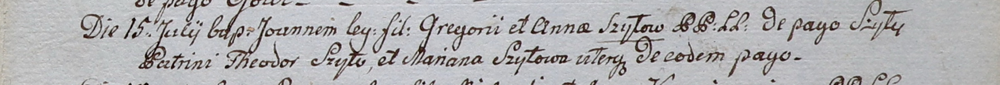
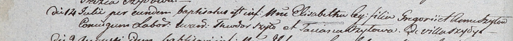

**Шило Грыгор (Szyło Hryhor)**

12 августа 1789 г -- крещение сына Мацея (НИАБ 136-13-894, лист 7об,
№39/1789-р (ориг)).

20 августа 1794 г -- крещение сына Андрей (НИАБ 136-13-894, лист 22об,
№32/1794-р (ориг)), (РГИА 823-2-18, лист 250об, №23/1794-р (коп)).

15 июля 1800 г -- крещение сына Иоанна (НИАБ 937-4-32, лист 2,
№21/1800-р).

14 июля 1803 г -- крещение дочери Элизабеты (НИАБ 937-4-32, лист 9об,
№22/1803-р).

**НИАБ 136-13-894:** Лист 7об. **Метрическая запись №39/1789-р (ориг).**

Дедиловичская Покровская церковь. 12 августа 1789 года. Метрическая
запись о крещении.

Szyło Maciej -- сын родителей с деревни Шилы.

Szyło Hryhor -- отец.

Szyłowa Anna -- мать.

Szyło Tomasz - кум.

Szyłowa Marjana - кума.

Jazgunowicz Antoni -- ксёндз.

**НИАБ 136-13-894:** Лист 22об. **Метрическая запись №32/1794-р
(ориг).**

Дедиловичская Покровская церковь. 20 августа 1794 года. Метрическая
запись о крещении.

Szyło Andrzey -- сын родителей с деревни Шилы.

Szyło Hryhory -- отец.

Szyłowa Anna -- мать.

Szyło Teodor - кум.

Szyłowa Marysia - кума.

Jazgunowicz Antoni -- ксёндз.

**РГИА 823-2-18:** Лист 250об. **Метрическая запись №23/1794-р (коп).**

Дедиловичская Покровская церковь. 20 августа 1794 года. Метрическая
запись о крещении.

Szyło Andrzey -- сын родителей с деревни Шилы.

Szyło Hryhor -- отец.

Szyłowa Anna -- мать.

Szyło Teodor -- кум.

Szyłowa Marysia -- кума.

Jazgunowicz Antoni -- ксёндз.

**НИАБ 937-4-32:** Лист 2. **Метрическая запись №21/1800-р.**

Дедиловичский костел Наисвятейшего Сердца Иисуса. 15 июля 1800 года.
Метрическая запись о крещении.

Szyło Joann -- сын крестьян с деревни Шилы.

Szyło Gregori -- отец.

Szyłowa Anna -- мать.

Szyło Theodor -- крестный отец, с деревни Шилы.

Szyłowa Mariana -- крестная мать, с деревни Шилы.

Linhart Hyacinthus -- ксёндз.

**НИАБ 937-4-32:** Лист 9об. **Метрическая запись №22/1803-р.**

Дедиловичский костел Наисвятейшего Сердца Иисуса. 14 июля 1803 года.
Метрическая запись о крещении.

Szyłowna Elisabetha -- дочь крестьян с деревни Шилы.

Szyło Gregori -- отец.

Szyłowa Anna -- мать.

Szyło Theodor -- крестный отец.

Szyłowa Taciana -- крестная мать.

Kłoczko Antoni -- ксёндз, администратор Ошмянского костела.
