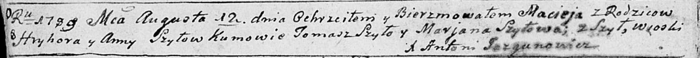

**Шило Мацей Грыгоров (Szyło Maciej)**

12 августа 1789 г -- крещение (НИАБ 136-13-894, лист 7об, №39/1789-р
(ориг)).

**НИАБ 136-13-894:** Лист 7об. **Метрическая запись №39/1789-р (ориг).**

Дедиловичская Покровская церковь. 12 августа 1789 года. Метрическая
запись о крещении.

Szyło Maciej -- сын родителей с деревни Шилы.

Szyło Hryhor -- отец.

Szyłowa Anna -- мать.

Szyło Tomasz - кум.

Szyłowa Marjana - кума.

Jazgunowicz Antoni -- ксёндз.
