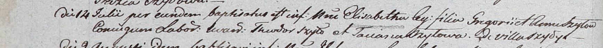

**Шило Элизабета Грыгорова (Szyłowna Elisabetha)**

14 июля 1803 г -- крещение (НИАБ 937-4-32, лист 9об, №22/1803-р).

**НИАБ 937-4-32:** Лист 9об. **Метрическая запись №22/1803-р.**

{width="6.496527777777778in"
height="0.5243055555555556in"}

Дедиловичский костел Наисвятейшего Сердца Иисуса. 14 июля 1803 года.
Метрическая запись о крещении.

Szyłowna Elisabetha -- дочь крестьян с деревни Шилы.

Szyło Gregori -- отец.

Szyłowa Anna -- мать.

Szyło Theodor -- крестный отец.

Szyłowa Taciana -- крестная мать.

Kłoczko Antoni -- ксёндз, администратор Ошмянского костела.
