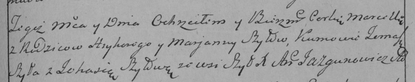
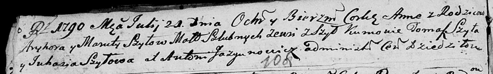

**Шило Марьяна (Szyłowna Marjana, Maruta)**

13 июня 1787 г -- крещение дочери Марцеллы (НИАБ 136-13-894, лист 2,
№23/1787-р (ориг)), (РГИА 823-2-18, лист 234, №15/1787-р (коп)).

21 июля 1790 г -- крещение дочери Анны (НИАБ 136-13-894, лист 10об,
№46/1790-р (ориг)).

**НИАБ 136-13-894:** Лист 2. **Метрическая запись №23/1787-р (ориг).**

Дедиловичская Покровская церковь. 13 июня 1787 года. Метрическая запись
о крещении.

С Шил.

Szyłowna Marcella - дочь родителей с деревни Шилы.

Szyło Hryhor -- отец.

Szyłowa Marjana -- мать.

Szyło Tomasz - кум.

Szyłowa? Juhasia - кума.

Jazgunowicz Antoniusz -- ксёндз.

**РГИА 823-2-18:** Лист 234. **Метрическая запись №15/1787-р (коп).**

Дедиловичская Покровская церковь. 13 июня 1787 года. Метрическая запись
о крещении.

Szyłowna Marcella -- дочь родителей с деревни Шилы.

Szyło Hryhory -- отец.

Szyłowa Marjanna -- мать.

Szyło Tomasz -- кум.

Szyłowa Johasia - кума.

Jazgunowicz Antoni -- ксёндз.

**НИАБ 136-13-894:** Лист 10об. **Метрическая запись №46/1790-р
(ориг).**

Дедиловичская Покровская церковь. 21 июля 1790 года. Метрическая запись
о крещении.

Szyłowna Anna -- дочь родителей с деревни Шилы.

Szyło Hryhor -- отец.

Szyłowa Maruta -- мать.

Szyło Tomasz - кум.

Szyłowa Juhasia - кума.

Jazgunowicz Antoni -- ксёндз.
