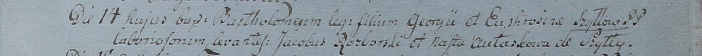

**Шило Бартоломей Грыгоров (Szyłło Bartołomiey)**

17 сентября 1799 г -- крещение (НИАБ 1781-27-199, лист 129, №41/1799-р).

**НИАБ 1781-27-199:** Лист 129. **Метрическая запись №41/1799-р.**

{width="6.496527777777778in"
height="0.5326388888888889in"}

Дедиловичский костел Наисвятейшего Сердца Иисуса. 17 сентября 1799 года.
Метрическая запись о крещении.

Szyłło Bartołomey -- сын крестьян с деревни Шилы.

Szyłło Georgi -- отец.

Szyłłowa Euphrosina -- мать.

Rozborski Jakub -- крестный отец.

Aułaskowa Nasta -- крестная мать.

Linhart Hyacinthus -- ксёндз.
