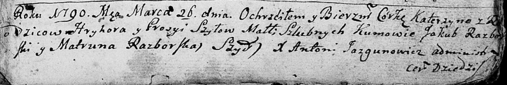

**Шило Грыгор (Szyło Hryhor, Georgi)**

26 марта 1790 г -- крещение дочери Катерыны (НИАБ 136-13-894, лист 9,
№22/1790-р (ориг)).

17 сентября 1799 г -- крещение сына Бартоломея (НИАБ 1781-27-199, лист
129, №41/1799-р).

**НИАБ 136-13-894:** Лист 9. **Метрическая запись №22/1790-р (ориг).**

Дедиловичская Покровская церковь. 26 марта 1790 года. Метрическая запись
о крещении.

Szyłowa Katerzyna -- дочь родителей с деревни Шилы.

Szyło Hryhor -- отец.

Szyłowa Prosyia -- мать.

Razborski Jakub - кум.

Razborska Matruna - кума.

Jazgunowicz Antonij -- ксёндз.

**НИАБ 1781-27-199:** Лист 129. **Метрическая запись №41/1799-р.**

Дедиловичский костел Наисвятейшего Сердца Иисуса. 17 сентября 1799 года.
Метрическая запись о крещении.

Szyłło Bartołomey -- сын крестьян с деревни Шилы.

Szyłło Georgi -- отец.

Szyłłowa Euphrosina -- мать.

Rozborski Jakub -- крестный отец.

Aułaskowa Nasta -- крестная мать.

Linhart Hyacinthus -- ксёндз.
