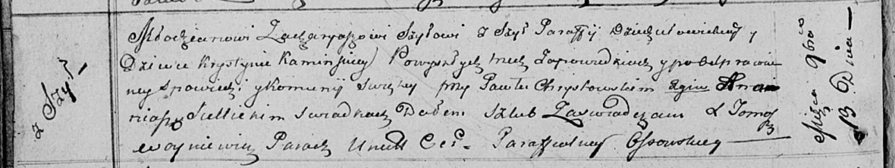

**Шило Захарий (Szyło Zacharyasz)**

13 ноября 1813 года -- венчание с девкой Каминской Крыстыной с деревни
Шилы (НИАБ 136-13-920, лист 20об, №28/1813-б (ориг)).

**НИАБ 136-13-894:** Лист 20об. **Метрическая запись №28/1813-б
(ориг).**

{width="6.496527777777778in"
height="1.2276957567804025in"}

Осовская Покровская церковь. 13 ноября 1813 года. Запись о венчании.

Szyło Zacharyasz -- жених, молодой, парафии Дедиловичской католической,
с деревни Шилы.

Kaminska Krystyna -- невеста, девка, с деревни Шилы.

Chrystowski Paweł -- свидетель.

Siellicki Ananiasz -- свидетель.

Woyniewicz Tomasz -- ксёндз.
