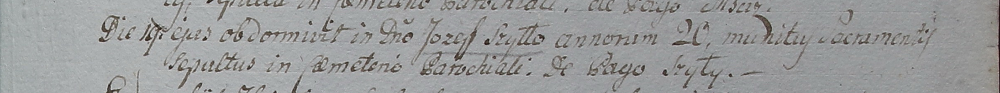

**Шило Иосиф (Szyło Joseph)**

20 октября 1798 года -- крещение сына Михала (НИАБ 1781-27-199, лист
123, №13/1798-р).

19 сентября 1799 года -- отпевание, умер в возрасте 20 лет (родился
около 1779 г) (НИАБ 1781-27-199, лист 131, №17/1799-у).

**НИАБ 1781-27-199:** Лист 123. **Метрическая запись №13/1798-р.**

{width="6.496527777777778in"
height="0.5965277777777778in"}

Дедиловичский костел Наисвятейшего Сердца Иисуса. 20 октября 1798 года.
Метрическая запись о крещении.

Szyło Michael -- сын крестьян с деревни Шилы.

Szyło Joseph -- отец.

Szyłowa Catharina -- мать.

Szyło Gaspar -- крестный отец.

Rozinkowa Culina - крестная мать.

Linhart Hyacinthus -- ксёндз.

**НИАБ 1781-27-199:** Лист 131. **Метрическая запись №17/1799-у.**

{width="6.496527777777778in"
height="0.6104166666666667in"}

Дедиловичский костел Наисвятейшего Сердца Иисуса. 19 сентября 1799 года.
Метрическая запись об отпевании.

Szyłło Josef -- умерший, 20 лет, с деревни Шилы.

Linhart Hyacinthus -- ксёндз.
