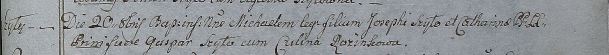

**Шило Михал Иосифов (Szyło Michael)**

20 октября 1798 года -- крещение (НИАБ 1781-27-199, лист 123,
№13/1798-р).

**НИАБ 1781-27-199:** Лист 123. **Метрическая запись №13/1798-р.**

{width="6.496527777777778in"
height="0.5965277777777778in"}

Дедиловичский костел Наисвятейшего Сердца Иисуса. 20 октября 1798 года.
Метрическая запись о крещении.

Szyło Michael -- сын крестьян с деревни Шилы.

Szyło Joseph -- отец.

Szyłowa Catharina -- мать.

Szyło Gaspar -- крестный отец.

Rozinkowa Culina - крестная мать.

Linhart Hyacinthus -- ксёндз.
