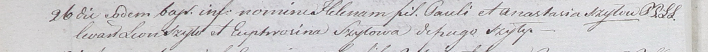

**Шило Леон (Szyło Leon)**

1 ноября 1788 года -- крещение дочери Анны (НИАБ 136-13-894, лист 5об,
№59/1788-р (ориг)), (РГИА 823-2-18, лист 237, №30/1788-р (коп)).

26 мая 1801 года -- крестный отец Елены, дочери Павла и Анастасии Шил с
деревни Шилы (НИАБ 937-4-32, лист 4об, №11/1801-р).

**НИАБ 136-13-894:** Лист 5об. **Метрическая запись №59/1788-р (ориг).**

{width="6.496527777777778in"
height="0.9708923884514435in"}

Дедиловичская Покровская церковь. 1 ноября 1788 года. Метрическая запись
о крещении.

Szyłowna Anna -- дочь родителей с деревни Шилы.

Szyło Leon -- отец.

Szyłowa Marcella -- мать.

Piotrowski Adam - кум.

Szuśtowska Nastazyia - кума.

Jazgunowicz Antoniusz -- ксёндз.

**РГИА 823-2-18:** Лист 237. **Метрическая запись №30/1788-р (коп).**

{width="6.496527777777778in"
height="1.6965277777777779in"}

Дедиловичская Покровская церковь. 1 ноября 1788 года. Метрическая запись
о крещении.

Szyłowna Anna -- дочь родителей с деревни Шилы.

Szyło Leon -- отец.

Szyłowa Marcella -- мать.

Piotrowski Adam -- кум.

Szustowska Nastazya - кума.

Jazgunowicz Antoni -- ксёндз.

**НИАБ 937-4-32:** Лист 4об. **Метрическая запись №11/1801-р.**

{width="6.496527777777778in"
height="0.4847222222222222in"}

Дедиловичский костел Наисвятейшего Сердца Иисуса. 26 мая 1801 года.
Метрическая запись о крещении.

Szyłowna Helena -- дочь крестьян с деревни Шилы.

Szyło Paul -- отец.

Szyłowa Anastasia -- мать.

Szyło Leon -- крестный отец, с деревни Шилы.

Szyłowa Eufrosina -- крестная мать, с деревни Шилы.

Linhart Hyacinthus -- ксёндз.
