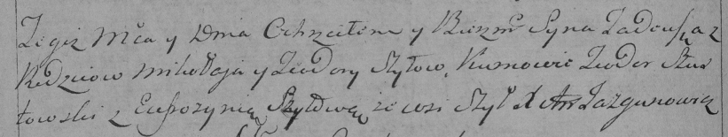

**Шило Тодора (Szyłowa Todora)**

22 августа 1794 года -- крещение сына Тадея (НИАБ 136-13-894, лист 22об,
№39/1794-р (ориг)), (РГИА 823-2-18, лист 250об, №25/1794-р (коп)).

**НИАБ 136-13-894:** Лист 22об. **Метрическая запись №39/1794-р
(ориг).**

{width="6.496527777777778in"
height="1.2444586614173228in"}

Дедиловичская Покровская церковь. 22 августа 1794 года. Метрическая
запись о крещении.

Szyło Tadeusz -- сын селян с деревни Шилы.

Szyło Mikołay -- отец.

Szyłowa Todora -- мать.

Szustowski Teodor - кум.

Szyłowa Efrozynia - кума.

Jazgunowicz Antoni -- ксёндз.

**РГИА 823-2-18:** Лист 250об. **Метрическая запись №26/1794-р (коп).**

{width="6.496527777777778in"
height="1.226388888888889in"}

Дедиловичская Покровская церковь. \[22\] августа 1794 года. Метрическая
запись о крещении.

Szyło Tadeusz -- сын родителей с деревни Шилы.

Szyło Mikołay -- отец.

Szyłowa Teodora -- мать.

Szustowski Teodor -- кум.

Szyłowa Eufrosynia -- кума.

Jazgunowicz Antoni -- ксёндз.
