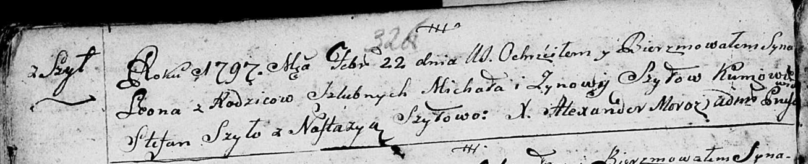
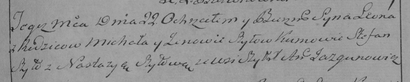

**Шило Миколай (Szyło Mikołay)**

22 февраля 1797 года -- крещение сына Леона (НИАБ 136-13-894, лист 32об,
№14/1797-р (ориг)), (РГИА 823-2-18, лист 259, №12/1797-р (коп)).

**НИАБ 136-13-894:** Лист 32об. **Метрическая запись №14/1797-р
(ориг).**

Дедиловичская Покровская церковь. 22 февраля 1797 года. Метрическая
запись о крещении.

Szyło Leon -- сын родителей с деревни Шилы.

Szyło Michał -- отец.

Szyłowa Zynowija -- мать.

Szyło Stefan - кум.

Szyłowa Nastazya - кума.

Jazgunowicz Antoni -- ксёндз.

**РГИА 823-2-18:** Лист 259. **Метрическая запись №12/1797-р (коп).**

Дедиловичская Покровская церковь. 22 февраля 1797 года. Метрическая
запись о крещении.

Szyło Leon -- сын родителей с деревни Шилы.

Szyło Michał -- отец.

Szyłowa Zenowia -- мать.

Szyło Stefan -- кум.

Szyłowa Nastazya -- кума.

Jazgunowicz Antoni -- ксёндз.
