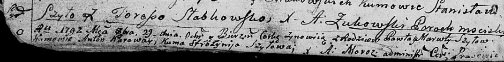

**Шило Марута (Szyłowa Maruta)**

29 октября 1792 года -- крещение дочери Зыновии (НИАБ 136-13-894, лист
16об, №55/1792-р (ориг)).

**НИАБ 136-13-894:** Лист 16об. **Метрическая запись №55/1792-р
(ориг).**

Дедиловичская Покровская церковь. 29 октября 1792 года. Метрическая
запись о крещении.

Szyłowna Zynowija -- дочь родителей с деревни Шилы.

Szyło Paweł -- отец.

Szyłowa Maruta -- мать.

Karaway Anton - кум.

Szyłowa Efrózynija - кума.

Moroz A. -- ксёндз, администратор Прусевичской церкви.
