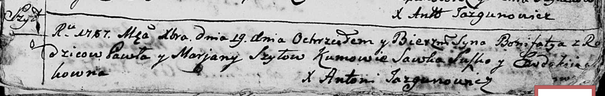

**Шило Бонифаты Павлов (Szyło Bonifaty)**

19 декабря 1787 года -- крещение (НИАБ 136-13-894, лист 3, №64/1787-р
(ориг)).

**НИАБ 136-13-894:** Лист 3. **Метрическая запись №64/1787-р (ориг).**

{width="6.496527777777778in"
height="1.0366010498687663in"}

Дедиловичская Покровская церковь. 19 декабря 1787 года. Метрическая
запись о крещении.

Szyło Bonifaty -- сын родителей с деревни Шилы.

Szyło Paweł -- отец.

Szyłowa Marjana -- мать.

Suszko Sawka - кум.

Suszkowna? Ewdokija - кума.

Jazgunowicz Antoni -- ксёндз
