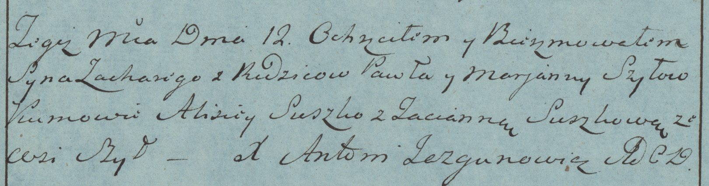

**Шило Захары Павлов (Szyło Zachary)**

12 марта 1783 г -- крещение (РГИА 823-2-18, лист 223об, №6/1783-р
(коп)).

**РГИА 823-2-18:** Лист 223об. **Метрическая запись №6/1783-р (коп).**

{width="6.496527777777778in"
height="1.707638888888889in"}

Дедиловичская Покровская церковь. 12 марта 1783 года. Метрическая запись
о крещении.

Szyło Zachary -- сын родителей с деревни Шилы.

Szyło Paweł -- отец.

Szyłowa Marjanna -- мать.

Suszko Alisiey -- кум.

Suszkowa Tacianna - кума.

Jazgunowicz Antoni -- ксёндз.
