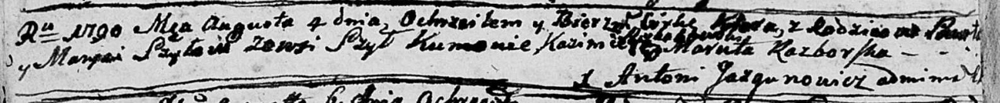

**Шило Павел (Szyło Paweł)**

12 марта 1783 г -- крещение сына Захарыя (РГИА 823-2-18, лист 223об,
№6/1783-р (коп)).

19 декабря 1787 года -- крещение сына Бонифатыя (НИАБ 136-13-894, лист
3, №64/1787-р (ориг)).

4 августа 1790 года -- крещение дочери К... (НИАБ 136-13-894, лист 10об,
№55/1790-р (ориг)).

**РГИА 823-2-18:** Лист 223об. **Метрическая запись №6/1783-р (коп).**

{width="6.496527777777778in"
height="1.707638888888889in"}

Дедиловичская Покровская церковь. 12 марта 1783 года. Метрическая запись
о крещении.

Szyło Zachary -- сын родителей с деревни Шилы.

Szyło Paweł -- отец.

Szyłowa Marjanna -- мать.

Suszko Alisiey -- кум.

Suszkowa Tacianna - кума.

Jazgunowicz Antoni -- ксёндз.

**НИАБ 136-13-894:** Лист 3. **Метрическая запись №64/1787-р (ориг).**

{width="6.496527777777778in"
height="1.0366010498687663in"}

Дедиловичская Покровская церковь. 19 декабря 1787 года. Метрическая
запись о крещении.

Szyło Bonifaty -- сын родителей с деревни Шилы.

Szyło Paweł -- отец.

Szyłowa Marjana -- мать.

Suszko Sawka - кум.

Suszkowna? Ewdokija - кума.

Jazgunowicz Antoni -- ксёндз

**НИАБ 136-13-894:** Лист 10об. **Метрическая запись №55/1790-р
(ориг).**

{width="6.496527777777778in"
height="0.6731878827646545in"}

Дедиловичская Покровская церковь. 4 августа 1790 года. Метрическая
запись о крещении.

Szyłowna K\... -- дочь родителей с деревни Шилы.

Szyło Paweł -- отец.

Szyłowa Marysia -- мать.

\...ski Kazimierz - кум.

Rozborska Maruta - кума.

Jazgunowicz Antoni -- ксёндз.
