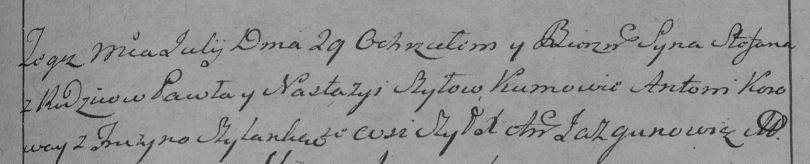

**Шило Степан Павлов (Szyło Stefan)**

29 июля 1795 года -- крещение (НИАБ 136-13-894, лист 25, №26/1795-р
(ориг)), (РГИА 823-2-18, лист 253, №21/1795-р (коп)).

**НИАБ 136-13-894:** Лист 25. **Метрическая запись №26/1795-р (ориг).**

{width="6.496527777777778in"
height="1.104323053368329in"}

Дедиловичская Покровская церковь. 29 июля 1795 года. Метрическая запись
о крещении.

Szyło Stefan -- сын родителей с деревни Шилы.

Szyło Paweł -- отец.

Szyłowa Nastazyia -- мать.

Karaway Anton - кум.

Szyłanka Fruzyna - кума.

Jazgunowicz Antoni -- ксёндз.

**РГИА 823-2-18:** Лист 253. **Метрическая запись №21/1795-р (коп).**

{width="6.496527777777778in"
height="1.3152777777777778in"}

Дедиловичская Покровская церковь. 29 июля 1795 года. Метрическая запись
о крещении.

Szyło Stefan -- сын родителей с деревни Шилы.

Szyło Paweł -- отец.

Szyłowa Nastazya -- мать.

Koroway Antoni -- кум.

Szyłanka Fruzyna -- кума.

Jazgunowicz Antoni -- ксёндз.
