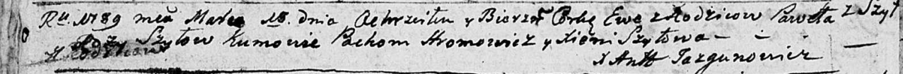

**Шило Ева Павлова (Szyłowna Ewa)**

19 марта 1789 года -- крещение (НИАБ 136-13-894, лист 6об, №17/1789-р
(ориг)).

**НИАБ 136-13-894:** Лист 6об. **Метрическая запись №17/1789-р (ориг).**

{width="6.496527777777778in"
height="0.5343930446194226in"}

Дедиловичская Покровская церковь. 19 марта 1789 года. Метрическая запись
о крещении.

Szyłowna Ewa -- дочь родителей с деревни Шилы.

Szyło Pawel -- отец.

Szyłowa Roza -- мать.

Hromowicz Pachom - кум.

Szyłowa Xienia - кума.

Jazgunowicz Antoni -- ксёндз.
