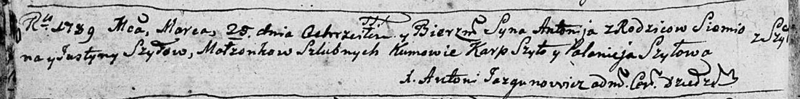

**Шило Антон Семёнов (Szyło Antonij)**

25 марта 1789 г -- крещение (НИАБ 136-13-894, лист 6об, №20/1789-р
(ориг)).

**НИАБ 136-13-894:** Лист 6об. **Метрическая запись №20/1789-р (ориг).**

{width="6.496527777777778in"
height="0.8106408573928259in"}

Дедиловичская Покровская церковь. 25 марта 1789 года. Метрическая запись
о крещении.

Szyło Antonij -- сын родителей с деревни Шилы.

Szyło Siomion -- отец.

Szyłowa Justyna -- мать.

Szyło Karp - кум.

Szyłowa Połonieja - кума.

Jazgunowicz Antoni -- ксёндз.
