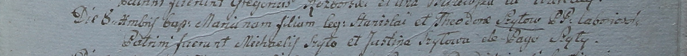

**Шило Мария Станиславова (Szyłowna Maria)**

8 декабря 1799 г -- крещение (НИАБ 1781-27-199, лист 129, №51/1799-р).

**НИАБ 1781-27-199:** Лист 129. **Метрическая запись №51/1799-р.**

{width="6.496527777777778in"
height="0.5333333333333333in"}

Дедиловичский костел Наисвятейшего Сердца Иисуса. 8 декабря 1799 года.
Метрическая запись о крещении.

Szyłowna Maria -- дочь крестьян с деревни Шилы.

Szyło Stanisłau -- отец.

Szyłowa Theodora -- мать.

Szyło Michaelis -- крестный отец.

Szyłowa Justina -- крестная мать.

Linhart Hyacinthus -- ксёндз.
