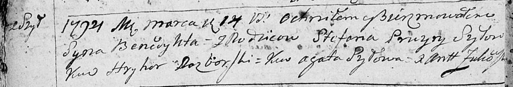

**Шило Бенедыкт Степанов (Szyło Benedykt)**

14 марта 1794 года -- крещение (НИАБ 136-13-894, лист 21об, №14/1794-р
(ориг)), (РГИА 823-2-18, лист 249об, №9/1794-р (коп)).

**НИАБ 136-13-894:** Лист 21-об. **Метрическая запись №14/1794-р
(ориг).**

Дедиловичская Покровская церковь. 14 марта 1794 года. Метрическая запись
о крещении.

Szyło Benedykt -- сын родителей с деревни Шилы.

Szyło Stefan -- отец.

Szyłowa Pruzyna -- мать.

Rozborski Chwiedor - кум.

Szyłowa Agata - кума.

Żukowski Antoni -- ксёндз.

**РГИА 823-2-18:** Лист 249об. **Метрическая запись №9/1794-р (коп).**

Дедиловичская Покровская церковь. 14 марта 1794 года. Метрическая запись
о крещении.

Szyło Benedykt -- сын родителей с деревни Шилы.

Szyło Stefan -- отец.

Szyłowa Pruzyna -- мать.

Rozborski Hryhor -- кум.

Szyłowa Agata -- кума.

Jazgunowicz Antoni -- ксёндз.
