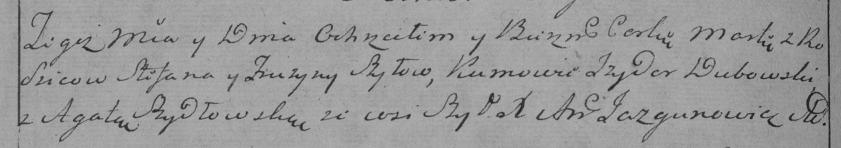

**Шило Катерына Степанова (Szyło Katerzyna)**

4 марта 1789 года -- крещение (НИАБ 136-13-894, лист 6об, №13/1789-р
(ориг)).

**НИАБ 136-13-894:** Лист 6об. **Метрическая запись №13/1789-р (ориг).**

{width="6.496527777777778in"
height="0.8743394575678041in"}

Дедиловичская Покровская церковь. 4 марта 1789 года. Метрическая запись
о крещении.

Szyłowna Katerzyna -- дочь родителей с деревни Шилы.

Szyło Stefan -- отец.

Szyłowa Pruzyna -- мать.

Rozborski Hryhor - кум.

Szyłanka Agata - кума.

Jazgunowicz Antoni -- ксёндз.
