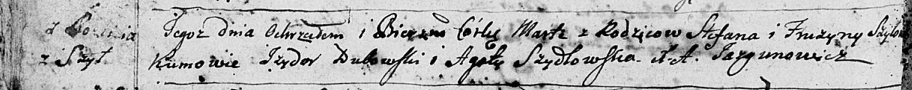

**Шило Марта Степанова младшая (Szyłowna Marta)**

8 июня 1796 года -- крещение (НИАБ 136-13-894, лист 29об, №61/1796-р
(ориг)), (РГИА 823-2-18, лист 256об, №33/1796-р (коп)).

**НИАБ 136-13-894:** Лист 29-об. **Метрическая запись №61/1796-р
(ориг).**

Дедиловичская Покровская церковь. 8 июня 1796 года. Метрическая запись о
крещении.

Szyłowna Marta -- дочь родителей с деревни Шилы.

Szyło Stefan -- отец.

Szyłowa Fruzyna -- мать.

Dubowski Jzydor - кум.

Szydłowska Agata - кума.

Jazgunowicz Antoni -- ксёндз.

**РГИА 823-2-18:** Лист 256об. **Метрическая запись №33/1796-р (коп).**

Дедиловичская Покровская церковь. \[8\] июня 1796 года. Метрическая
запись о крещении.

Szyłowna Marta -- дочь родителей с деревни Шилы.

Szyło Stefan -- отец.

Szyłowa Fruzyna -- мать.

Dubowski Jzydor -- кум.

Szydłowska Agata -- кума.

Jazgunowicz Antoni -- ксёндз.
