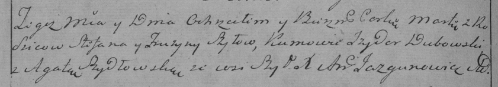

**Шило Степан (Szyło Stefan)**

2 января 1788 года -- крещение сына Яна (НИАБ 136-13-894, лист 3об,
№4/1788-р (ориг)).

4 марта 1789 года -- крещение дочери Катерыны (НИАБ 136-13-894, лист
6об, №13/1789-р (ориг)).

3 августа 1791 года -- крещение дочери Марты (НИАБ 136-13-894, лист
13об, №35/1791-р (ориг)).

14 марта 1794 года -- крещение сына Бенедыкта (НИАБ 136-13-894, лист
21об, №14/1794-р (ориг)), (РГИА 823-2-18, лист 249об, №9/1794-р (коп)).

8 июня 1796 года -- крещение дочери Марты младшей (НИАБ 136-13-894, лист
29об, №61/1796-р (ориг)), (РГИА 823-2-18, лист 256об, №33/1796-р (коп)).

24 апреля 1799 года -- крещение сына Георгия (НИАБ 1781-27-199, лист
125, №23/1799-р).

22 февраля 1805 года -- крещение сына Винцентия (НИАБ 937-4-32, лист 11,
№8/1805-р).

**НИАБ 136-13-894:** Лист 3об. **Метрическая запись №4/1788-р (ориг).**

Дедиловичская Покровская церковь. 2 января 1788 года. Метрическая запись
о крещении.

Szyło Jan -- сын родителей с деревни Шилы.

Szyło Stefan -- отец.

Szyłowa Fruzyna -- мать.

Rozborski Hryhor - кум.

Piotrowska Xienia - кума.

Jazgunowicz Antoniusz -- ксёндз.

**НИАБ 136-13-894:** Лист 6об. **Метрическая запись №13/1789-р (ориг).**

Дедиловичская Покровская церковь. 4 марта 1789 года. Метрическая запись
о крещении.

Szyłowna Katerzyna -- дочь родителей с деревни Шилы.

Szyło Stefan -- отец.

Szyłowa Pruzyna -- мать.

Rozborski Hryhor - кум.

Szyłanka Agata - кума.

Jazgunowicz Antoni -- ксёндз.

**НИАБ 136-13-894:** Лист 13об. **Метрическая запись №35/1791-р
(ориг).**

Дедиловичская Покровская церковь. 3 августа 1791 года. Метрическая
запись о крещении.

Szyłowna Marta -- дочь родителей с деревни Шилы.

Szyło Stefan -- отец.

Szyłowa Fruzyna -- мать.

Rozborski Hryhory - кум.

Szyłanka Agata - кума.

Jazgunowicz Antoni -- ксёндз.

**НИАБ 136-13-894:** Лист 21-об. **Метрическая запись №14/1794-р
(ориг).**

Дедиловичская Покровская церковь. 14 марта 1794 года. Метрическая запись
о крещении.

Szyło Benedykt -- сын родителей с деревни Шилы.

Szyło Stefan -- отец.

Szyłowa Pruzyna -- мать.

Rozborski Chwiedor - кум.

Szyłowa Agata - кума.

Żukowski Antoni -- ксёндз.

**РГИА 823-2-18:** Лист 249об. **Метрическая запись №9/1794-р (коп).**

Дедиловичская Покровская церковь. 14 марта 1794 года. Метрическая запись
о крещении.

Szyło Benedykt -- сын родителей с деревни Шилы.

Szyło Stefan -- отец.

Szyłowa Pruzyna -- мать.

Rozborski Hryhor -- кум.

Szyłowa Agata -- кума.

Jazgunowicz Antoni -- ксёндз.

**НИАБ 136-13-894:** Лист 29-об. **Метрическая запись №61/1796-р
(ориг).**

Дедиловичская Покровская церковь. 8 июня 1796 года. Метрическая запись о
крещении.

Szyłowna Marta -- дочь родителей с деревни Шилы.

Szyło Stefan -- отец.

Szyłowa Fruzyna -- мать.

Dubowski Jzydor - кум.

Szydłowska Agata - кума.

Jazgunowicz Antoni -- ксёндз.

**РГИА 823-2-18:** Лист 256об. **Метрическая запись №33/1796-р (коп).**

Дедиловичская Покровская церковь. \[8\] июня 1796 года. Метрическая
запись о крещении.

Szyłowna Marta -- дочь родителей с деревни Шилы.

Szyło Stefan -- отец.

Szyłowa Fruzyna -- мать.

Dubowski Jzydor -- кум.

Szydłowska Agata -- кума.

Jazgunowicz Antoni -- ксёндз.

**НИАБ 1781-27-199:** Лист 125об. **Метрическая запись №23/1799-р.**

Дедиловичский костел Наисвятейшего Сердца Иисуса. 24 апреля 1799 года.
Метрическая запись о крещении.

Szyło Georgi -- сын крестьян с деревни Шилы.

Szyło Stefan -- отец.

Szyłowa Eufrosina -- мать.

Rozborski Gregorius -- крестный отец.

Szydłowska Agatha - крестная мать.

Linhart Hyacinthus -- ксёндз.

**НИАБ 937-4-32:** Лист 11. **Метрическая запись №8/1805-р.**

Дедиловичский костел Наисвятейшего Сердца Иисуса. 22 февраля 1805 года.
Метрическая запись о крещении.

Szyło Vincenti -- сын родителей с деревни Шилы.

Szyło Stephan -- отец.

Szyłowa Euphrosina -- мать.

Rozborski Stephan -- крестный отец.

Szyłowa Agatha -- крестная мать, с деревни Веретей.

Linhart Hiacinthus -- ксёндз.
