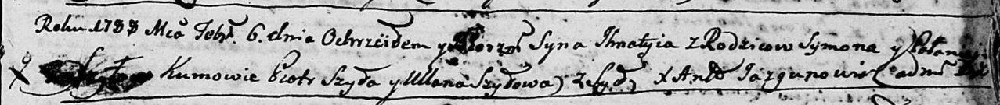

**Шило Игнаты Сымонов (Szyło Jhnaty)**

6 февраля 1788 г -- крещение (НИАБ 136-13-894, лист 4, №15/1788-р
(ориг)).

**НИАБ 136-13-894:** Лист 4. **Метрическая запись №15/1788-р (ориг).**

{width="6.496527777777778in"
height="0.6865977690288714in"}

Дедиловичская Покровская церковь. 6 февраля 1788 года. Метрическая
запись о крещении.

Szyło Jhnaty -- сын родителей с деревни Шилы.

Szyło Symon -- отец.

Szyłowa Pałanieja -- мать.

Szyło Piotr - кум.

Szyłowa Ullana - кума.

Jazgunowicz Antoniusz -- ксёндз.
