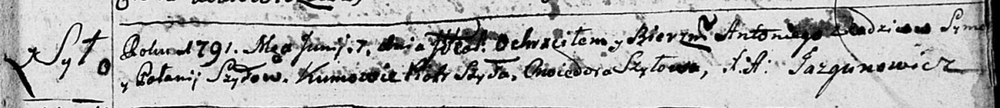

**Шило Паланея (Szyłowa Pałanieja, Połonija)**

6 февраля 1788 г -- крещение сына Игнатыя (НИАБ 136-13-894, лист 4,
№15/1788-р (ориг)).

7 июня 1791 г -- крещение сына Антона (НИАБ 136-13-894, лист 13,
№24/1791-р (ориг)).

**НИАБ 136-13-894:** Лист 4. **Метрическая запись №15/1788-р (ориг).**

Дедиловичская Покровская церковь. 6 февраля 1788 года. Метрическая
запись о крещении.

Szyło Jhnaty -- сын родителей с деревни Шилы.

Szyło Symon -- отец.

Szyłowa Pałanieja -- мать.

Szyło Piotr - кум.

Szyłowa Ullana - кума.

Jazgunowicz Antoniusz -- ксёндз.

**НИАБ 136-13-894:** Лист 13. **Метрическая запись №24/1791-р (ориг).**

Дедиловичская Покровская церковь. 7 июня 1791 года. Метрическая запись о
крещении.

Szyło Antonij -- дочь родителей с деревни Шилы.

Szyło Symon -- отец.

Szyłowa Polonija -- мать.

Szyło Piotr -- кум.

Szyłowa Chwiedora - кума.

Jazgunowicz Antoni -- ксёндз.
