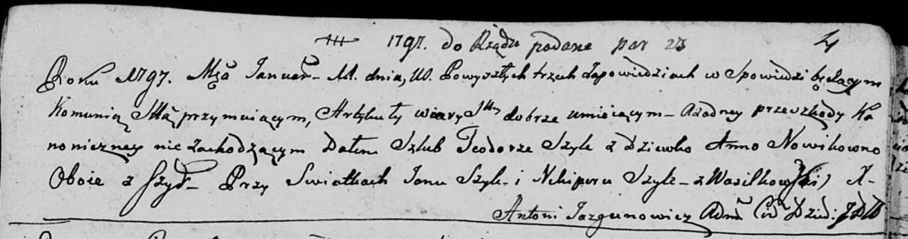
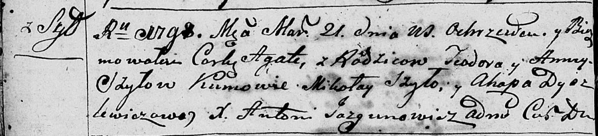
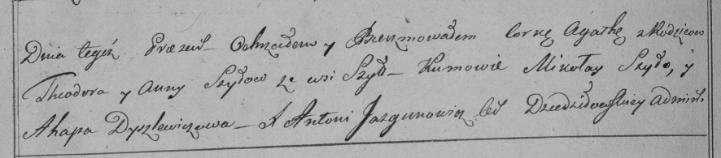
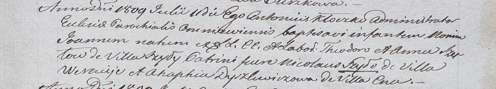

**Шило (Новик) Анна (Szyłowa Anna z Nowikow)**

11 января 1797 года -- венчание с Тодором Шило с деревни Шилы (НИАБ
136-13-920, лист 4, №1/1797-б (ориг)).

21 марта 1798 года -- крещение дочери Агаты (НИАБ 136-13-894, лист 35об,
№10/1798-р (ориг)), (РГИА 823-2-18, лист 262об, №10/1798-р (коп)).

11 июля 1809 г -- крещение сына Иоанна (НИАБ 937-4-32, лист 20,
№22/1809-р).

**НИАБ 136-13-920:** Лист Лист 4. **Метрическая запись №1/1797-б
(ориг).**

Дедиловичская Покровская церковь. 11 января 1797 года. Метрическая
запись о венчании.

Szyło Teodor -- жених, с деревни Шилы.

Nowikowna Anna -- невеста, девка, с деревни Шилы.

Szyło Jan -- свидетель.

Szyło Nikipor -- свидетель, деревня Васильковка.

Jazgunowicz Antoni -- ксёндз.

**НИАБ 136-13-894:** Лист 35-об. **Метрическая запись №10.**

Дедиловичская Покровская церковь. 21 марта 1798 года. Метрическая запись
о крещении.

Szyłowna Agata -- дочь родителей с деревни Шилы.

Szyło Teodor -- отец.

Szyłowa Anna -- мать.

Szyło Mikołay - кум.

Dydzlewiczowa Ahapa - кума.

Jazgunowicz Antoni -- ксёндз.

**РГИА 823-2-18:** Лист 262об. **Метрическая запись №10/1798-р (коп).**

Дедиловичская Покровская церковь. 21 марта 1798 года. Метрическая запись
о крещении.

Szyłowna Agatha -- дочь родителей с деревни \[Шилы\].

Szyło Theodor -- отец.

Szyłowa Anna -- мать.

Szyło Mikołay -- кум.

Dyszlewiczowa Ahapa -- кума.

Jazgunowicz Antoni -- ксёндз.

**НИАБ 937-4-32:** Лист 20. **Метрическая запись №22/1809-р.**

Дедиловичский костел Наисвятейшего Сердца Иисуса. 11 июля 1809 года.
Метрическая запись о крещении.

Szyło Joann -- сын крестьян с деревни Шилы.

Szyło Theodor -- отец.

Szyłowa Anna -- мать.

Szyło Nikołay -- крестный отец, с деревни Веретей.

Dyszlewiczowa Ahaphia -- крестная мать, с деревни Цна.

Kłoczko Antonius -- ксёндз, администратор Ошмянский.
