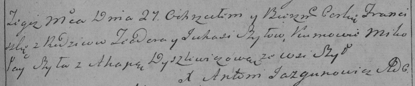

**Шило Юхася (Szyłowa Juhasia)**

27 марта 1792 года -- крещение дочери Францишки (НИАБ 136-13-894, лист
15, №13/1792-р (ориг)), (РГИА 823-2-18, лист 244, №7/1792-р (коп)).

**НИАБ 136-13-894:** Лист 15. **Метрическая запись №13/1792-р (ориг).**

{width="6.496527777777778in"
height="0.592726377952756in"}

Дедиловичская Покровская церковь. 27 марта 1792 года. Метрическая запись
о крещении.

Szyłowna Franciszka -- дочь родителей с деревни Шилы.

Szyło Teodor -- отец, селянин.

Szyłowa Juhasia -- мать, селянка.

Szyło Mikołay -- кум.

Dyszlewiczowa Ahapa - кума.

Jazgunowicz Antoni -- ксёндз.

**РГИА 823-2-16:**Лист 244. **Метрическая запись №7/1792-р (коп).**

{width="6.496527777777778in"
height="1.3486111111111112in"}

Дедиловичская Покровская церковь. 27 марта 1792 года. Метрическая запись
о крещении.

Szyłowna Franciszka -- дочь родителей с деревни Шилы.

Szyło Teodor -- отец.

Szyłowa Juhasia -- мать.

Szyło Mikołay -- кум.

Dyszlewiczowa Ahapa - кума.

Jazgunowicz Antoni -- ксёндз.
