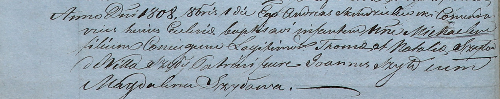

**Шило Томаш (Szyło Thoma)**

1 октября 1808 г -- крещение сына Михала (НИАБ 937-4-32, лист 18об,
№24/1808-р).

**НИАБ 937-4-32:** Лист 18об. **Метрическая запись №24/1808-р.**

Дедиловичский костел Наисвятейшего Сердца Иисуса. 1 октября 1808 года.
Метрическая запись о крещении.

Szyło Michael -- сын родителей с деревни Шилы.

Szyło Thoma -- отец.

Szyłowa Natalia -- мать.

Szyło Joann -- крестный отец.

Szyłowa Magdalena -- крестная мать.

Scindzelewski Andreas -- ксёндз, комендант Дедиловичский.
