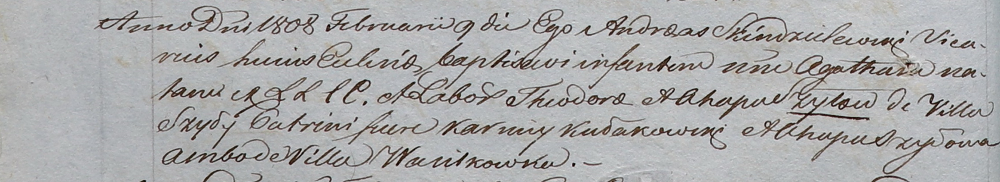

**Шило Агата Хведорова (Szyłowna Agatha)**

9 февраля 1808 года -- крещение (НИАБ 937-4-32, лист 17об, №5/1808-р).

**НИАБ 937-4-32:** Лист 17об. **Метрическая запись №5/1808-р.**

Дедиловичский костел Наисвятейшего Сердца Иисуса. 9 февраля 1808 года.
Метрическая запись о крещении.

Szyłowna Agatha -- дочь крестьян с деревни Шилы.

Szyło Theodor -- отец.

Szyłowa Ahapa -- мать.

Kułakowski Karniey -- крестный отец, с деревни Васильковка.

Szyłowa Ahapa -- крестная мать, с деревни Васильковка.

Scindzelewski Andreas -- ксёндз, викарий Дедиловичский.
