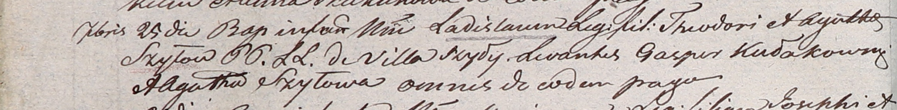

**Шило Роман Хведоров (Szyło Roman)**

27 февраля 1810 года -- крещение (НИАБ 937-4-32, лист 21об, №10/1810-р).

**НИАБ 937-4-32:** Лист 21об. **Метрическая запись №10/1810-р.**

{width="6.496527777777778in"
height="1.2965277777777777in"}

Дедиловичский костел Наисвятейшего Сердца Иисуса. 27 февраля 1810 года.
Метрическая запись о крещении.

Szyło Roman -- сын крестьян с деревни Шилы.

Szyło Theodor -- отец.

Szyłowa Ahaphia -- мать.

Kułakowski Cornelius -- крестный отец.

Szyłowa Ahaphia -- крестная мать, с деревни Шилы.

Miszkun Marcus -- ксёндз, с кармелитского монастыря.
