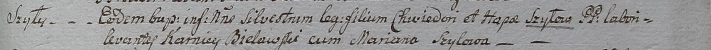

**Шило Сильвестр Хведоров (Szyło Silvester)**

14 января 1799 года -- крещение (НИАБ 1781-27-199, лист 125, №6/1799-р).

**НИАБ 1781-27-199:** Лист 125. **Метрическая запись №6/1799-р.**

Дедиловичский костел Наисвятейшего Сердца Иисуса. 14 января 1799 года.
Метрическая запись о крещении.

Szyło Silvester -- дочь крестьян с деревни Шилы.

Szyło Chwiedor -- отец.

Szyłowa Hapa -- мать.

Bielawski Karniey -- крестный отец.

Szyłowa Mariana - крестная мать.

Linhart Hyacinthus -- ксёндз.
