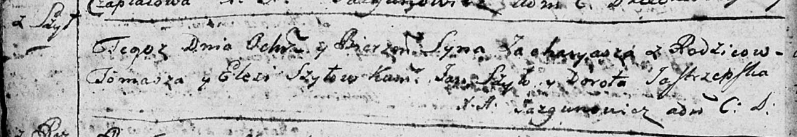
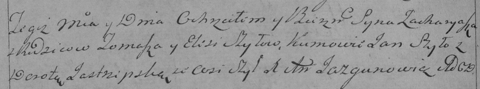

**Шило Захары Хомов (Szyło Zachariasz)**

27 августа 1794 года -- крещение (НИАБ 136-13-894, лист 22об, №36/1794-р
(ориг)), (РГИА 823-2-18, лист 250об, №24/1794-р (коп)).

**НИАБ 136-13-894:** Лист 22об. **Метрическая запись №36/1794-р
(ориг).**

Дедиловичская Покровская церковь. 27 августа 1794 года. Метрическая
запись о крещении.

Szyło Zacharyasz -- сын родителей с деревни Шилы.

Szyło Tomasz -- отец.

Szyłowa Elesia -- мать.

Szyło Jan - кум.

Jastrzepska Dorota - кума.

Jazgunowicz Antoni -- ксёндз.

**РГИА 823-2-18:** Лист 250об. **Метрическая запись №25/1794-р (коп).**

Дедиловичская Покровская церковь. 27 августа 1794 года. Метрическая
запись о крещении.

Szyło Zacharyasz -- сын родителей с деревни Шилы.

Szyło Tomasz -- отец.

Szyłowa Elesia -- мать.

Szyło Jan -- кум.

Jastrzepska Dorota -- кума.

Jazgunowicz Antoni -- ксёндз.
