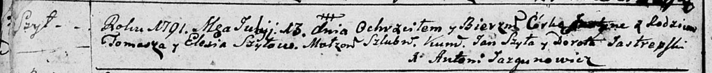

**Шило Юстына Хомова (Szyłowna Justyna)**

13 июля 1791 года -- крещение (НИАБ 136-13-894, лист 13об, №31/1791-р
(ориг)).

**НИАБ 136-13-894:** Лист 13об. **Метрическая запись №31/1791-р
(ориг).**

Дедиловичская Покровская церковь. 13 июля 1791 года. Метрическая запись
о крещении.

Szyłowna Justyna -- дочь родителей с деревни Шилы.

Szyło Tomasz -- отец.

Szyło Elesia -- мать.

Szyło Jan - кум.

Jastrepska Dorota - кума.

Jazgunowicz Antoni -- ксёндз.
