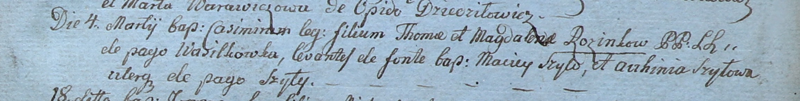
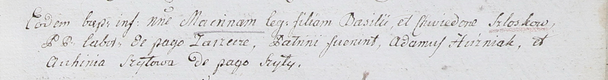

**Шило Авхиня (Szyłowa Auchinia)**

4 марта 1800 г -- крестная мать Казимира, сына Хомы и Магдалены Розынков
с деревни Васильковка (НИАБ 937-4-32, лист 1, №4/1800-р).

26 ноября 1802 г -- крестная мать Макрыны, дочери Базыля и Хведоры
Слёзков (НИАБ 937-4-32, лист 8, №41/1802-р).

**НИАБ 937-4-32:** Лист 1. **Метрическая запись №4/1800-р.**

Дедиловичский костел Наисвятейшего Сердца Иисуса. 4 марта 1800 года.
Метрическая запись о крещении.

Rozinko Casimir -- сын крестьян с деревни Васильковка.

Rozinko Thoma -- отец.

Rozinkowa Magdalena -- мать.

Szyło Maciey -- крестный отец, с деревни Шилы.

Szyłowa Auchinia -- крестная мать, с деревни Шилы.

Linhart Hyacinthus -- ксёндз.

**НИАБ 937-4-32:** Лист 8. **Метрическая запись №41/1802-р.**

Дедиловичский костел Наисвятейшего Сердца Иисуса. 26 ноября 1802 года.
Метрическая запись о крещении.

Szłoskowna Maсrina -- дочь крестьян с деревни Заречье.

Szłoska Basili -- отец.

Szłoskowa Chwiedora -- мать.

Huzniak Adam -- крестный отец.

Szyłowa Auchinia -- крестная мать, с деревни Шилы.

Linhart Hyacinthus -- ксёндз.
