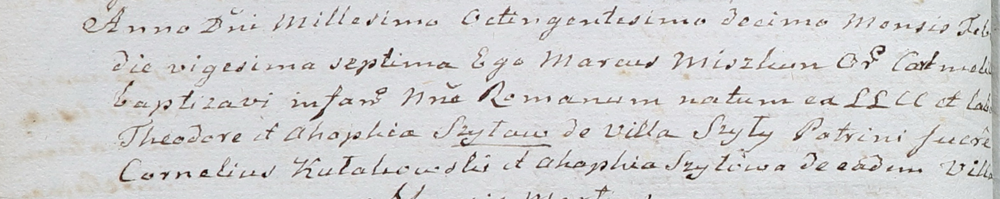

**Шило Агата (Szyłowa Agatha, Ahaphia)**

25 сентября 1804 года -- крестная мать Владислава, сына Хведора и Гапы
Шил с деревни Шилы (НИАБ 937-4-32, лист 10об, №22/1804-р).

27 февраля 1810 года -- крестная мать Романа, сына Хведора и Гапы Шил с
деревни Шилы (НИАБ 937-4-32, лист 21об, №10/1810-р).

**НИАБ 937-4-32:** Лист 10об. **Метрическая запись №22/1804-р.**

{width="6.496527777777778in"
height="0.8048611111111111in"}

Дедиловичский костел Наисвятейшего Сердца Иисуса. 25 сентября 1804 года.
Метрическая запись о крещении.

Szyło Ładisław -- сын родителей с деревни Шилы.

Szyło Theodor -- отец.

Szyłowa Agatha -- мать.

Kułakowski Gasper -- крестный отец, с деревни Шилы.

Szyłowa Agatha -- крестная мать, с деревни Шилы.

Galinowski Joann -- ксёндз, комендант Дедиловичского костела.

**НИАБ 937-4-32:** Лист 21об. **Метрическая запись №10/1810-р.**

{width="6.496527777777778in"
height="1.2965277777777777in"}

Дедиловичский костел Наисвятейшего Сердца Иисуса. 27 февраля 1810 года.
Метрическая запись о крещении.

Szyło Roman -- сын крестьян с деревни Шилы.

Szyło Theodor -- отец.

Szyłowa Ahaphia -- мать.

Kułakowski Cornelius -- крестный отец.

Szyłowa Ahaphia -- крестная мать, с деревни Шилы.

Miszkun Marcus -- ксёндз, с кармелитского монастыря.
