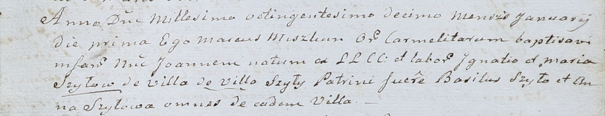

**Шило Анна (Szyłowa Anna)**

1 января 1810 г -- крестная мать Иоанна, сына Игнатия и Марии Шил с
деревни Шилы (НИАБ 937-4-32, лист 21, №2/1810-р).

**НИАБ 937-4-32:** Лист 21. **Метрическая запись №2/1810-р.**

Дедиловичский костел Наисвятейшего Сердца Иисуса. 1 января 1810 года.
Метрическая запись о крещении.

Szyło Joann -- сын крестьян с деревни Шилы.

Szyło Jgnati -- отец.

Szyłowa Maria -- мать.

Szyło Basil -- крестный отец, с деревни Шилы.

Szyłowa Anna -- крестная мать, с деревни Шилы.

Miszkun Marcus -- ксёндз, комендант Дедиловичский.
