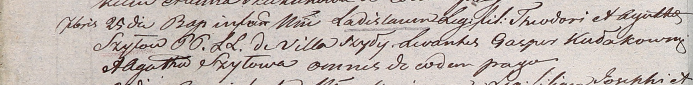

**Шило Базыль (Szyło Basil)**

28 апреля 1800 г -- крестный отец Иосифа, сына Владыся и Агапы Шил с
деревни Шилы (НИАБ 937-4-32, лист 1, №12/1800-р).

**НИАБ 937-4-32:** Лист 1. **Метрическая запись №12/1800-р.**

{width="6.496527777777778in"
height="0.5958333333333333in"}

Дедиловичский костел Наисвятейшего Сердца Иисуса. 28 апреля 1800 года.
Метрическая запись о крещении.

Szyło Joseph -- сын крестьян с деревни Шилы.

Szyło Władisław -- отец.

Szyłowa Hapa -- мать.

Szyło Basil -- крестный отец, с деревни Шилы.

Krasowska Dorothea -- крестная мать, с деревни Шилы.

Linhart Hyacinthus -- ксёндз.
