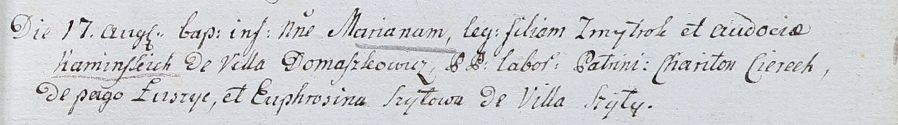

**Шило Евфрозина (Szyłowa Euphrosina)**

26 мая 1801 года -- крестная мать Елены, дочери Павла и Анастасии Шил с
деревни Шилы (НИАБ 937-4-32, лист 4об, №11/1801-р).

17 августа 1802 г -- крестная мать Марьяны, дочери Змитрока и Авдотьи
Каминских с деревни Домашковичи (НИАБ 937-4-32, лист 7, №23/1802-р).

**НИАБ 937-4-32:** Лист 7. **Метрическая запись №23/1802-р.**

Дедиловичский костел Наисвятейшего Сердца Иисуса. 17 августа 1802 года.
Метрическая запись о крещении.

Kaminska Mariana -- дочь крестьян с деревни Домашковичи.

Kaminski Zmytrok -- отец.

Kaminska Audocia -- мать.

Cierech Chariton -- крестный отец, крестьянин, с деревни Лустичи.

Szyłowa Euphrosina -- крестная мать, крестьянка, с деревни Шилы.

Linhart Hyacinthus -- ксёндз.
