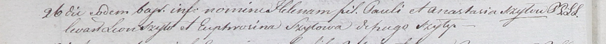

**Шило Евфрозина (Szyłowa Eufrosina)**

26 мая 1801 года -- крестная мать Елены, дочери Павла и Анастасии Шил с
деревни Шилы (НИАБ 937-4-32, лист 4об, №11/1801-р).

**НИАБ 937-4-32:** Лист 4об. **Метрическая запись №11/1801-р.**

Дедиловичский костел Наисвятейшего Сердца Иисуса. 26 мая 1801 года.
Метрическая запись о крещении.

Szyłowna Helena -- дочь крестьян с деревни Шилы.

Szyło Paul -- отец.

Szyłowa Anastasia -- мать.

Szyło Leon -- крестный отец, с деревни Шилы.

Szyłowa Eufrosina -- крестная мать, с деревни Шилы.

Linhart Hyacinthus -- ксёндз.
