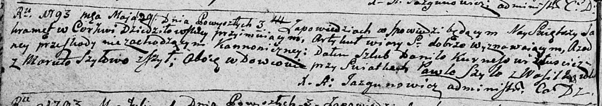

**Шило (Курнеш) Марута (Kurneszowa Maruta z Szyłow)**

29 мая 1793 г -- венчание с Данилой Курнешом с деревни Лустичи (НИАБ
136-13-894, лист 71об, №3/1793-б (ориг)).

**НИАБ 136-13-894:** Лист 71об. **Метрическая запись №3/1793-б (ориг).**

Дедиловичская Покровская церковь. 29 мая 1793 года. Метрическая запись о
венчании.

Kurnesz Daniło -- жених, вдовец, с деревни Лустичи.

Szyłowa Maruta -- невеста, вдова, с деревни Шилы.

Szyło Paweł -- свидетель, с деревни Васильковка.

Jazgunowicz Antoni -- ксёндз.
