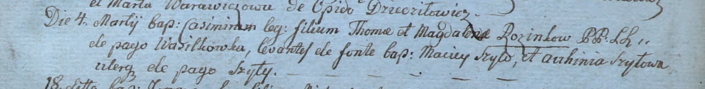

**Шило Матей (Szyło Maciey)**

4 марта 1800 г -- крестный отец Казимира, сына Хомы и Магдалены Розынков
с деревни Васильковка (НИАБ 937-4-32, лист 1, №4/1800-р).

**НИАБ 937-4-32:** Лист 1. **Метрическая запись №4/1800-р.**

Дедиловичский костел Наисвятейшего Сердца Иисуса. 4 марта 1800 года.
Метрическая запись о крещении.

Rozinko Casimir -- сын крестьян с деревни Васильковка.

Rozinko Thoma -- отец.

Rozinkowa Magdalena -- мать.

Szyło Maciey -- крестный отец, с деревни Шилы.

Szyłowa Auchinia -- крестная мать, с деревни Шилы.

Linhart Hyacinthus -- ксёндз.
