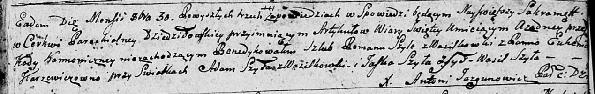

**Шило Яська (Szyło Jaśka)**

30 октября 1793 г -- свидетель венчания Романа Шило с деревни
Васильковка и Евгении Каржевич (НИАБ 136-13-894, лист 72, №21/1793-б
(ориг)).

**НИАБ 136-13-894:** Лист 72. **Метрическая запись №6/1793-б (ориг).**

Дедиловичская Покровская церковь. 30 октября 1793 года. Метрическая
запись о венчании.

Szyło Roman -- жених, с деревни Васильковка.

Karżewiczowna Euhenija -- невеста.

Szyło Adam -- свидетель, с деревни Васильковка.

Szyło Jaśka -- свидетель, с деревни Шилы.

Szyło Wasil -- свидетель.

Jazgunowicz Antoni -- ксёндз.
