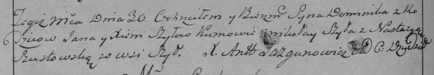

**Шило Доминик Янов (Szyło Dominik)**

19 августа 1788 г -- крещение (НИАБ 136-13-894, лист 5, №46/1788-р
(ориг)), (РГИА 823-2-18, лист 236об, №24/1788-р (коп)).

**НИАБ 136-13-894:** Лист 5. **Метрическая запись №46/1788-р (ориг).**

Дедиловичская Покровская церковь. 19 августа 1788 года. Метрическая
запись о крещении.

Szyło Dominik -- сын родителей с деревни Шилы.

Szyło Janka -- отец.

Szyłowa Xienia -- мать.

Szyło Mikołay - кум.

Susztowska Nastazyia - кума.

Jazgunowicz Antoni -- ксёндз.

**РГИА 823-2-18:** Лист 236об. **Метрическая запись №24/1788-р (коп).**

Дедиловичская Покровская церковь. 30 августа 1788 года. Метрическая
запись о крещении.

Szyło Dominik -- сын родителей с деревни Шилы.

Szyło Jan -- отец.

Szyłowa Xienia -- мать.

Szyło Mikołay -- кум.

Szustowska Nastazya - кума.

Jazgunowicz Antoni -- ксёндз.
