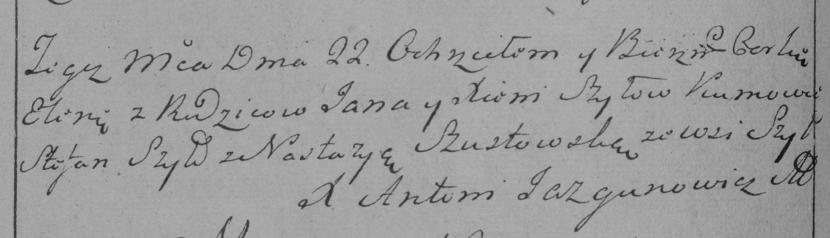

**Шило Елена Янова (Szyłowna Elena)**

22 октября 1784 г -- крещение (РГИА 823-2-18, лист 227об, №22/1784-р
(коп)).

**РГИА 823-2-18:** Лист 227об. **Метрическая запись №22/1784-р (коп).**

{width="6.496527777777778in"
height="1.8631944444444444in"}

Дедиловичская Покровская церковь. 22 октября 1784 года. Метрическая
запись о крещении.

Szyłowna Elena -- дочь родителей с деревни Шилы.

Szyło Jan -- отец.

Szyłowa Xienia -- мать.

Szyło Stefan -- кум.

Szustowska Nastazya - кума.

Jazgunowicz Antoni -- ксёндз.
