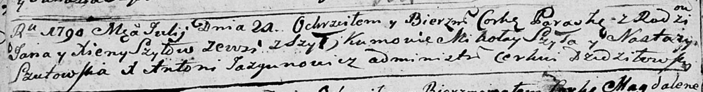

**Шило Параска Янова (Szyłowna Paraska)**

21 июля 1790 -- крещение (НИАБ 136-13-894, лист 10об, №47/1790-р
(ориг)).

**НИАБ 136-13-894:** Лист 10об. **Метрическая запись №47/1790-р
(ориг).**

{width="6.496527777777778in"
height="0.8542235345581802in"}

Дедиловичская Покровская церковь. 21 июля 1790 года. Метрическая запись
о крещении.

Szyłowna Paraska -- дочь родителей с деревни Шилы.

Szyło Jan -- отец.

Szyłowa Xienia -- мать.

Szyło Mikołay - кум.

Szutowska Nastazya - кума.

Jazgunowicz Antoni -- ксёндз.
